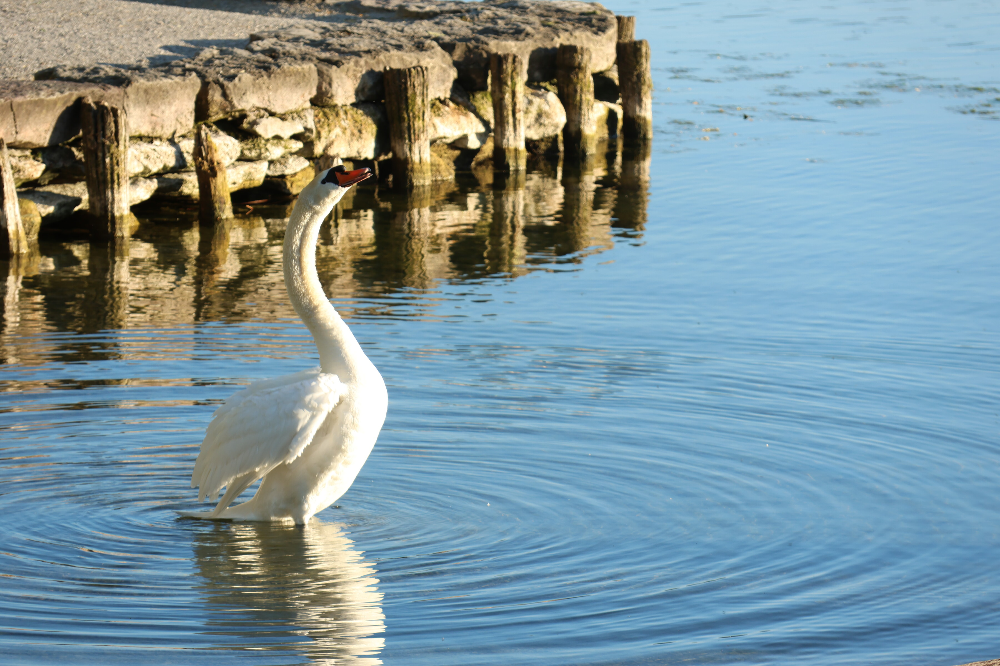
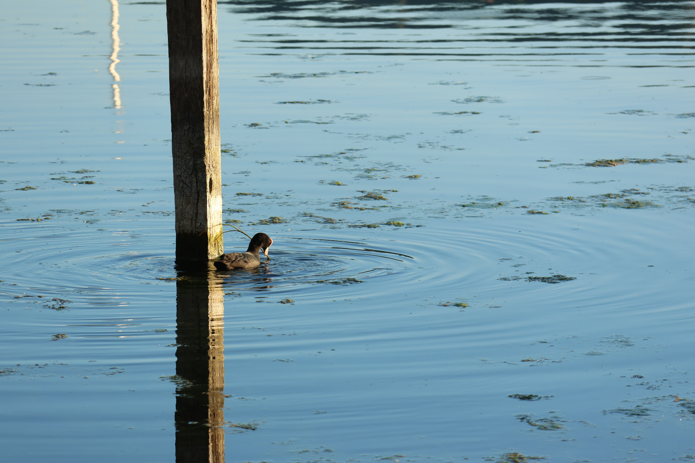
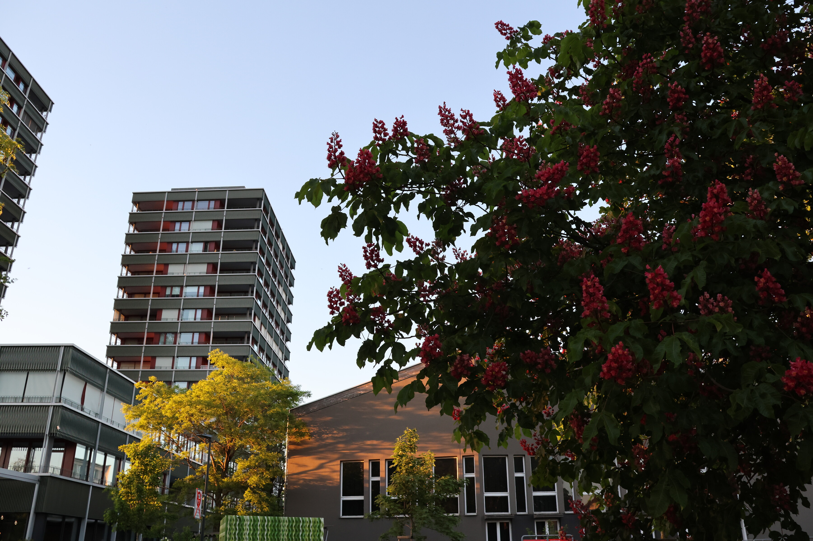
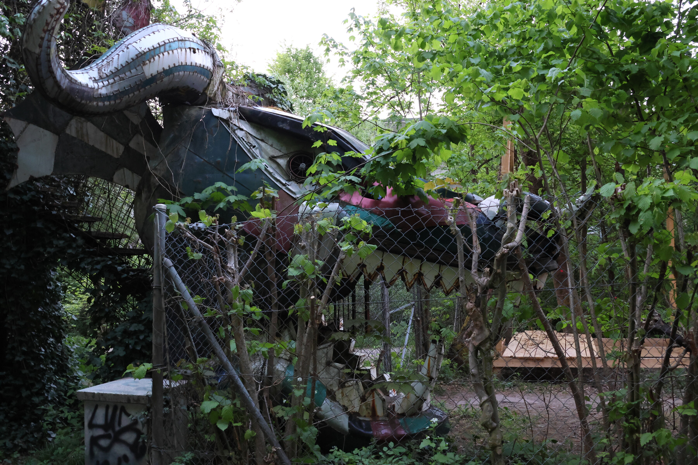
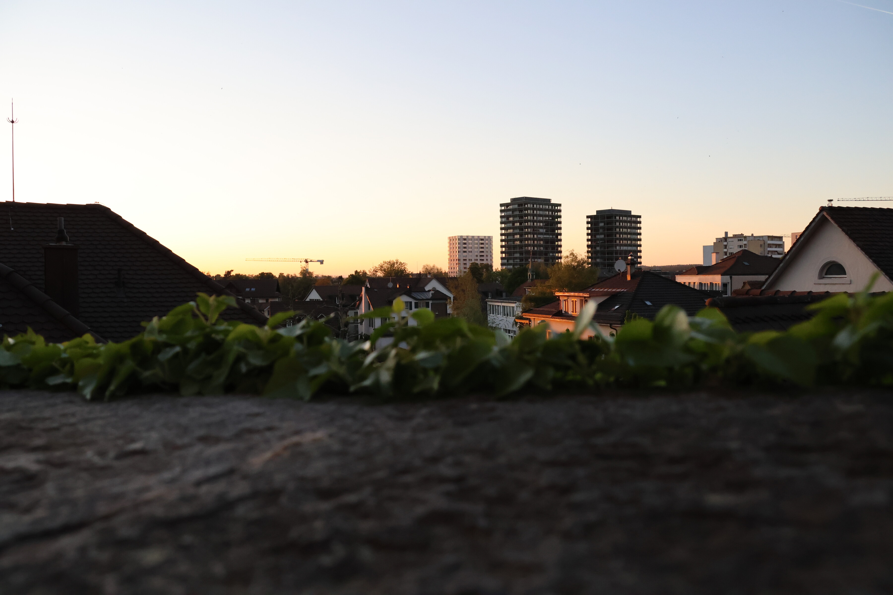
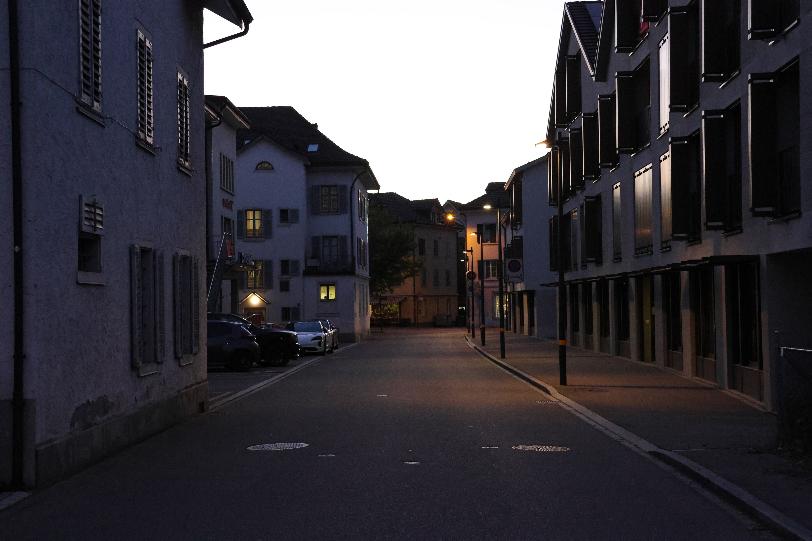
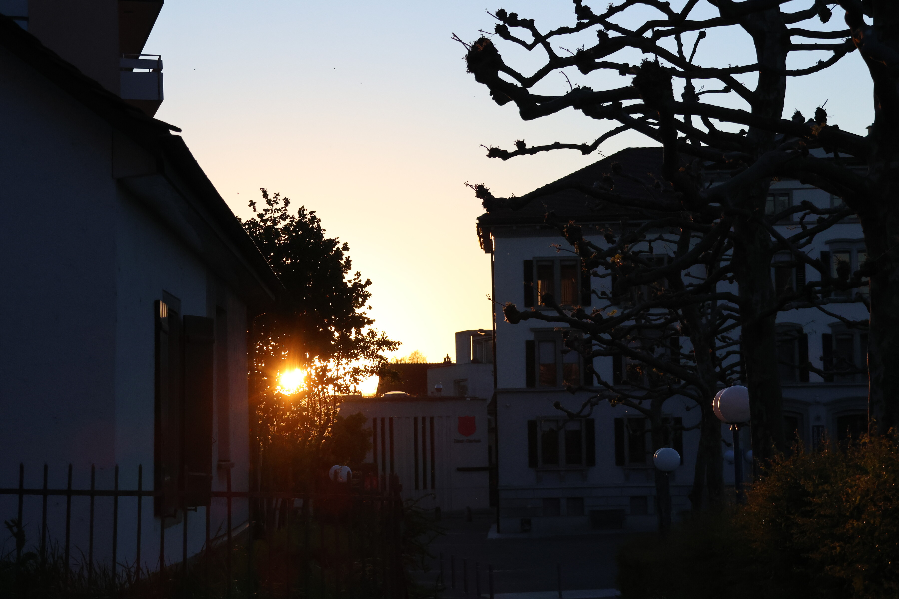
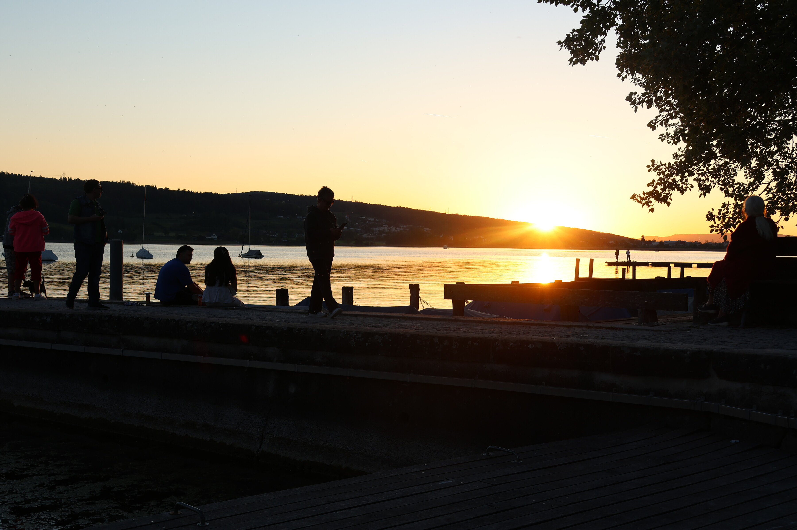

Beatiful spring evenings in the city of Uster and along the shores of Greifensee in the Zürich Oberland.

::: {layout-ncol=1}
{group="greifensee"}

{group="greifensee"}

{group="greifensee"}

{group="greifensee"}

{group="greifensee"}

{group="greifensee"}

{group="greifensee"}

{group="greifensee"}

{group="greifensee"}
:::
