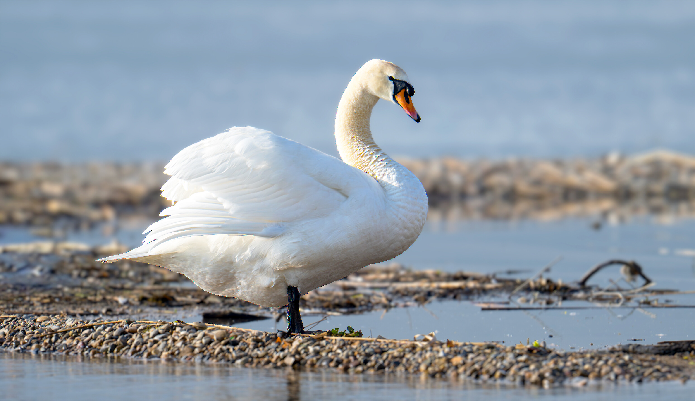
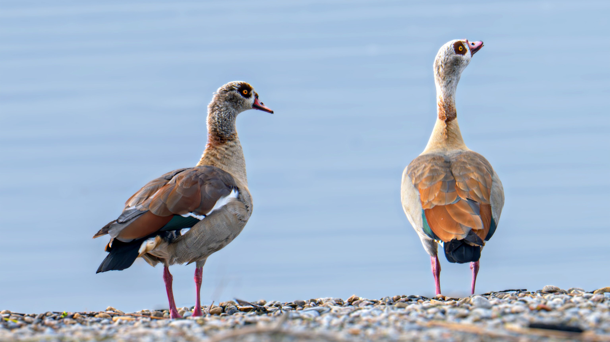
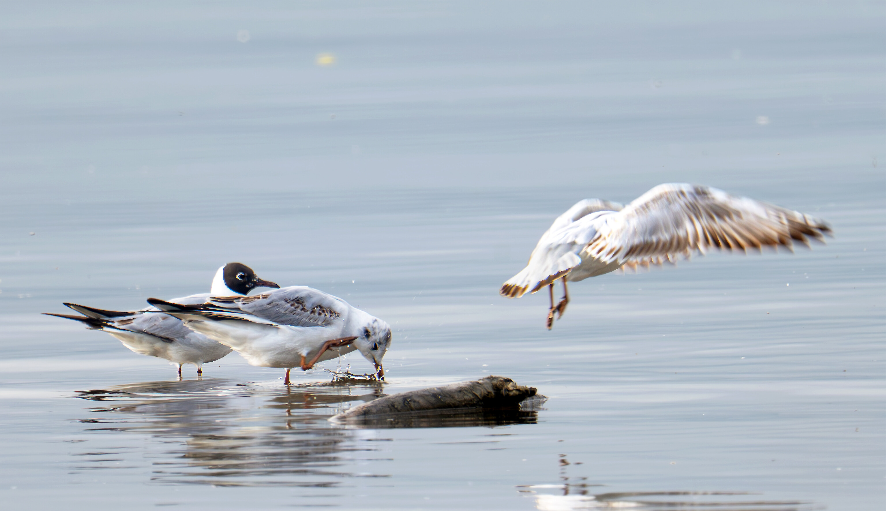
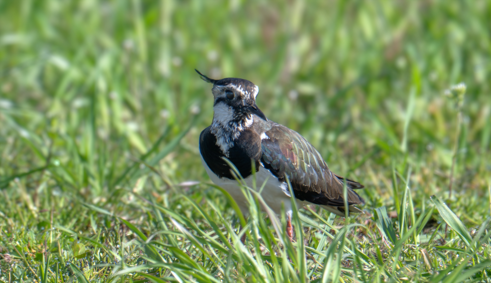
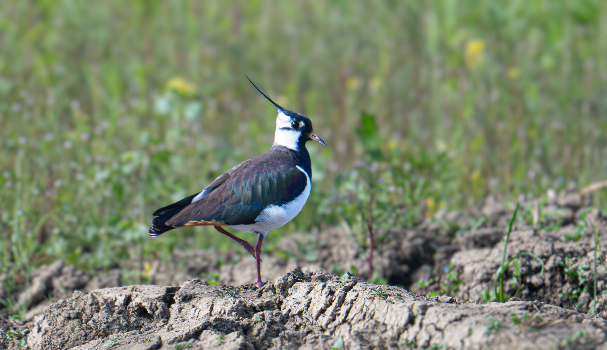

A spring afternoon along the shores of Lake Zurich --- perfect conditions for spotting waterbirds and waders. The first stop was Stampf, where the pebbly shore attracted a swan, a pair of Egyptian geese, and a busy group of black-headed gulls. Later, the fields around Nuolen revealed a pair of lapwings foraging in the open grassland.

---

## Stampf

### Mute Swan

A mute swan standing tall on the gravel shore, feathers ruffled by the breeze.

{fig-alt="Mute swan standing on a pebbly lakeshore with soft blue water in the background"}

### Egyptian Geese

A pair of Egyptian geese scanning the horizon from the water's edge --- the iridescent teal wing patches catching the afternoon light.

{fig-alt="A pair of Egyptian geese standing side by side on a gravel shore with calm blue water behind them"}

### Black-headed Gulls

A small flock of black-headed gulls gathered on the shallow water, one just taking off.

{fig-alt="Black-headed gulls standing in shallow water, one gull taking flight with wings spread"}

---

## Nuolen

### Northern Lapwing

The lapwing's unmistakable crest and iridescent plumage make it one of the most striking waders in Switzerland. Spotted a pair foraging in the fields.

::: {layout-ncol=2}

{fig-alt="Northern lapwing standing in green grass, showing its distinctive crest and dark iridescent plumage" group="lapwing"}

{fig-alt="Northern lapwing walking on muddy plowed ground with green vegetation in the background" group="lapwing"}

:::
