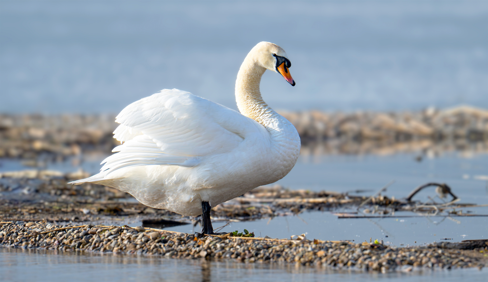
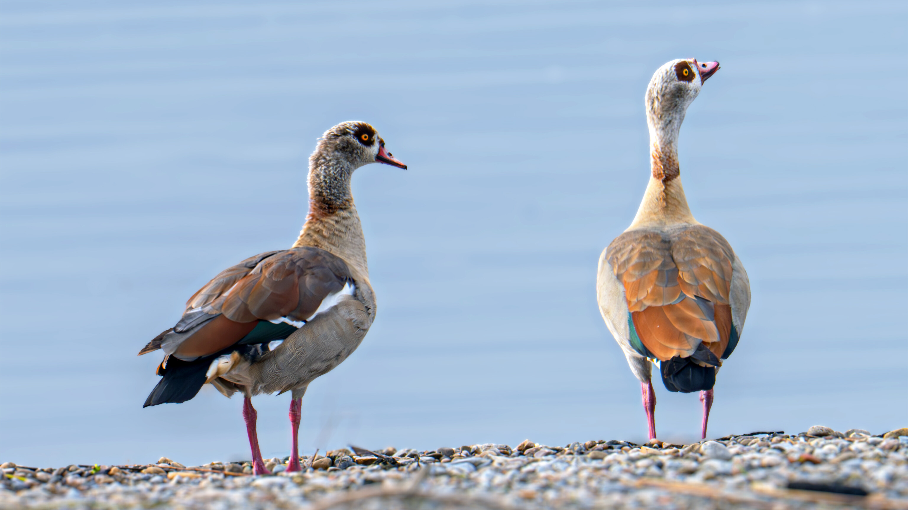
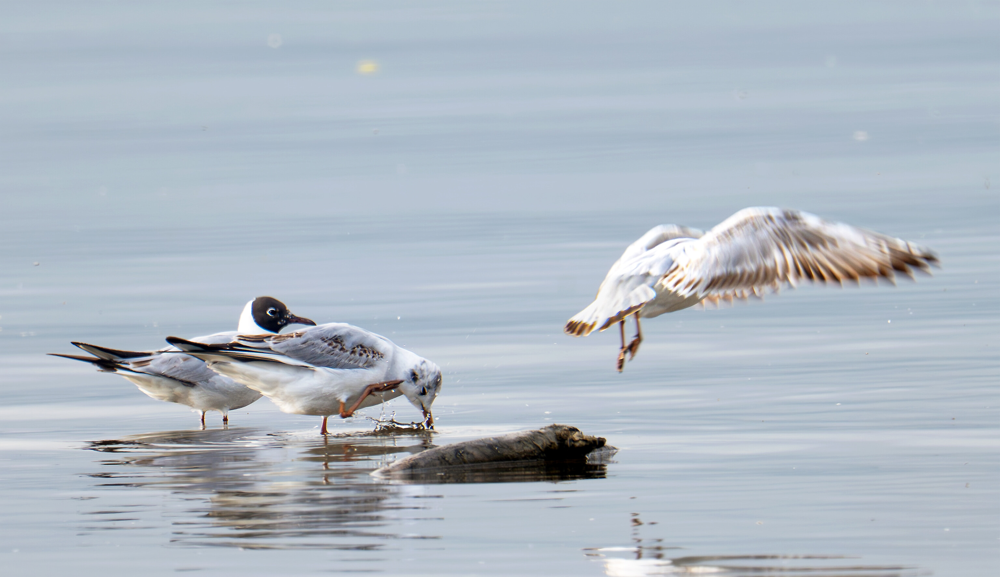
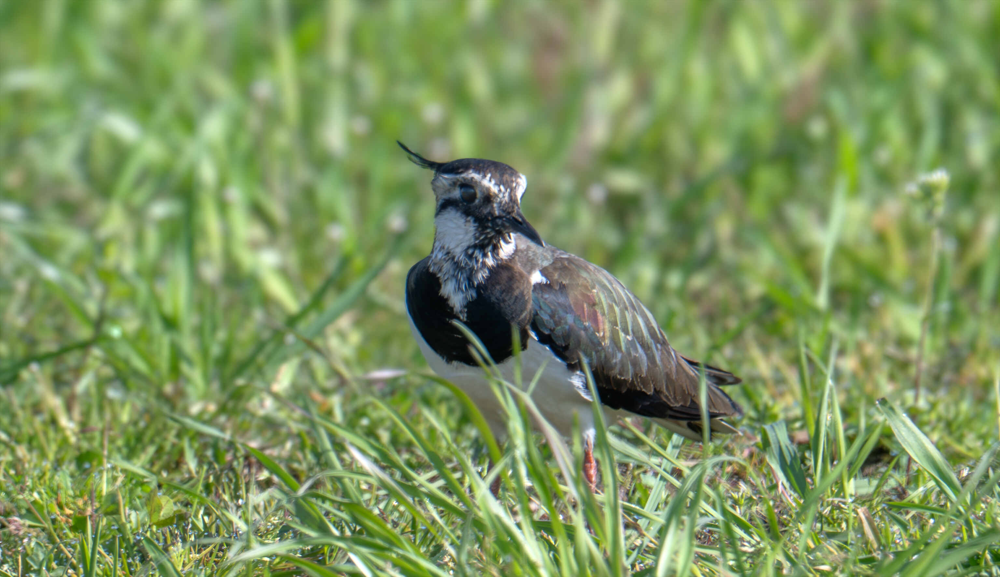
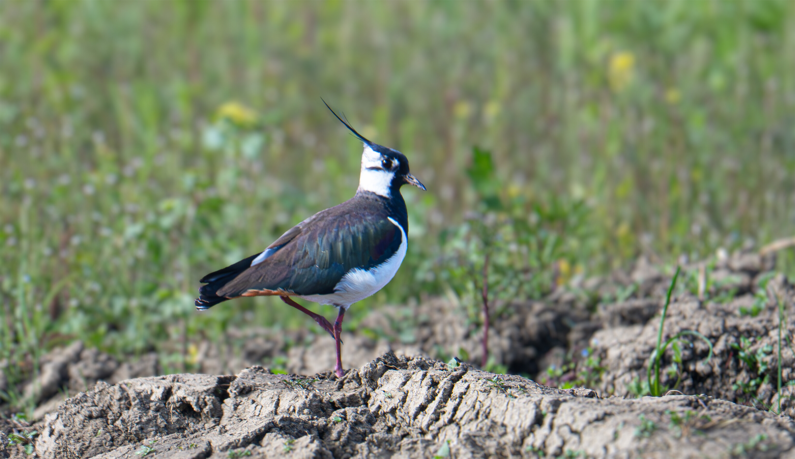

```{=html}
<div class="jhs-album-intro">
  <p class="jhs-page-intro">
  A spring afternoon along the shores of Lake Zurich — waterbirds at Stampf, lapwings in the
  fields around Nuolen.</p>
</div>

<h2 class="jhs-album-section-title">Waterbirds at Stampf</h2>
<div class="jhs-album-grid">
  <div class="tile"></div>
  <div class="tile"></div>
  <div class="tile"></div>
</div>

<h2 class="jhs-album-section-title">Fields around Nuolen</h2>
<div class="jhs-album-grid">
  <div class="tile"></div>
  <div class="tile"></div>
</div>
```
