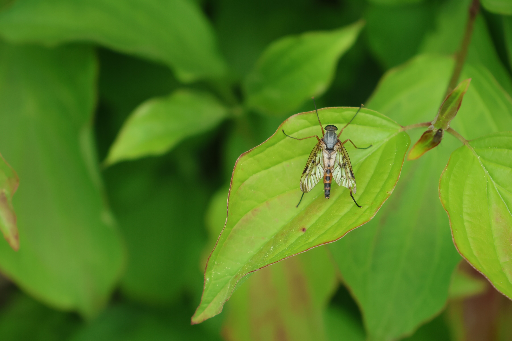
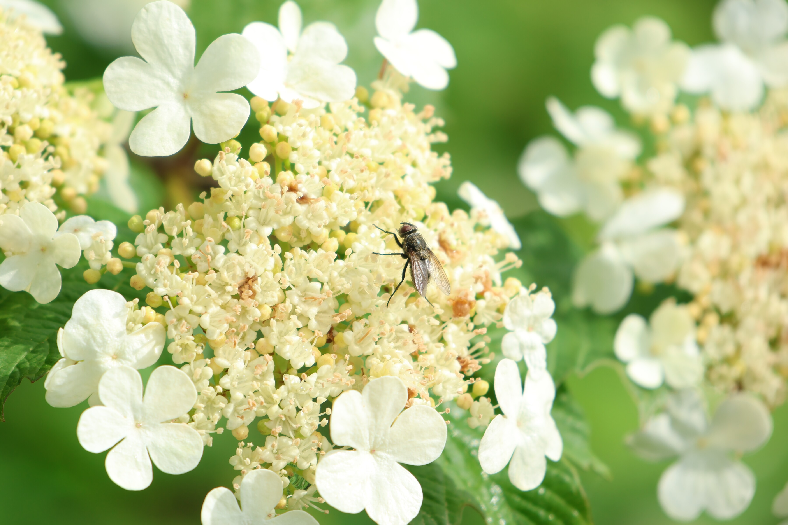
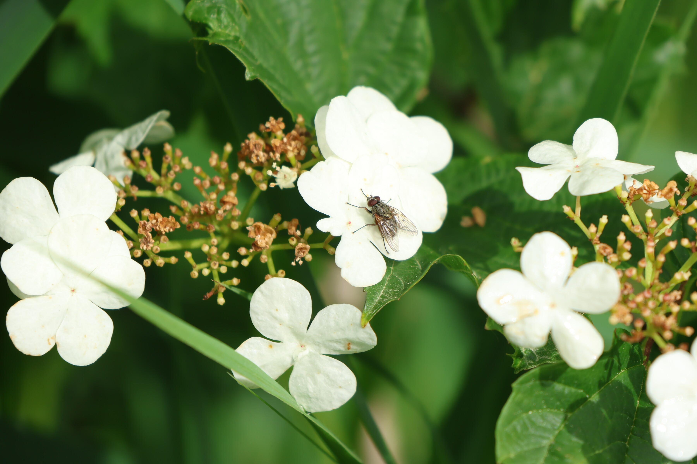
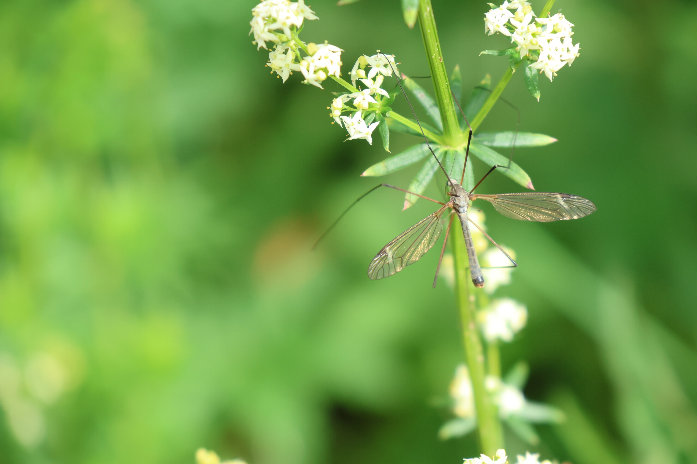
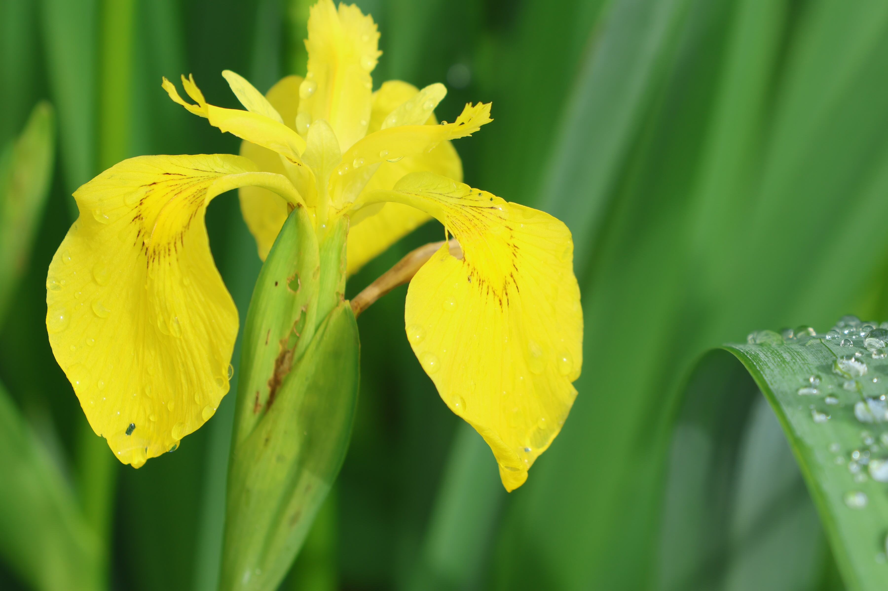
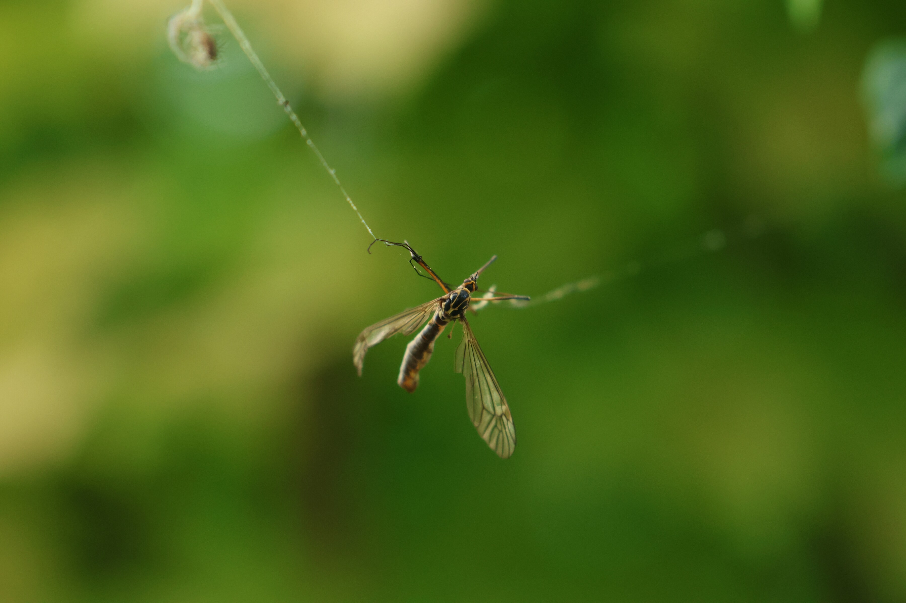
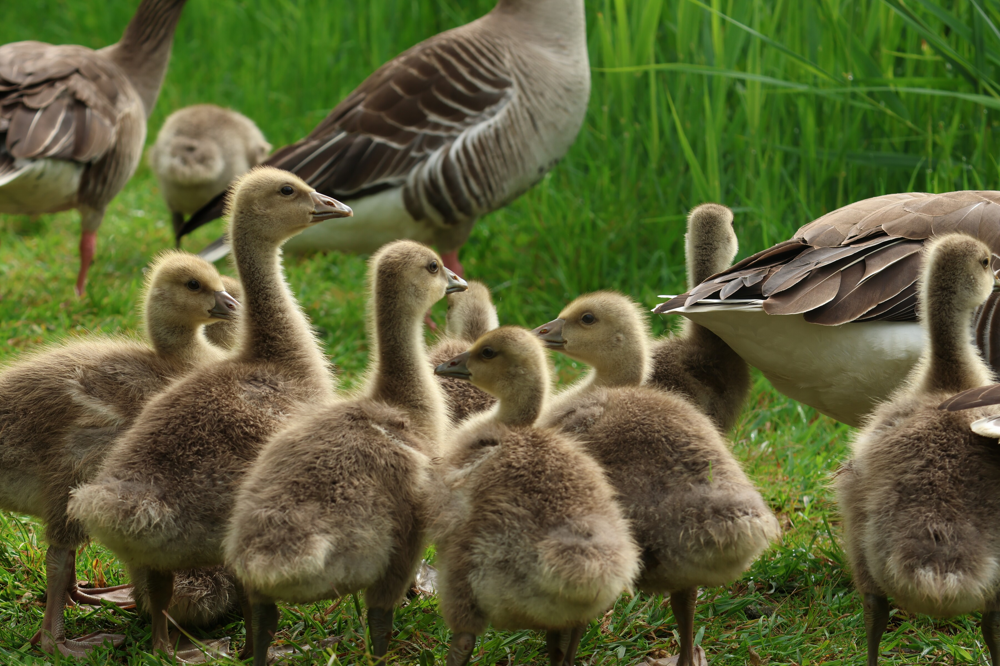
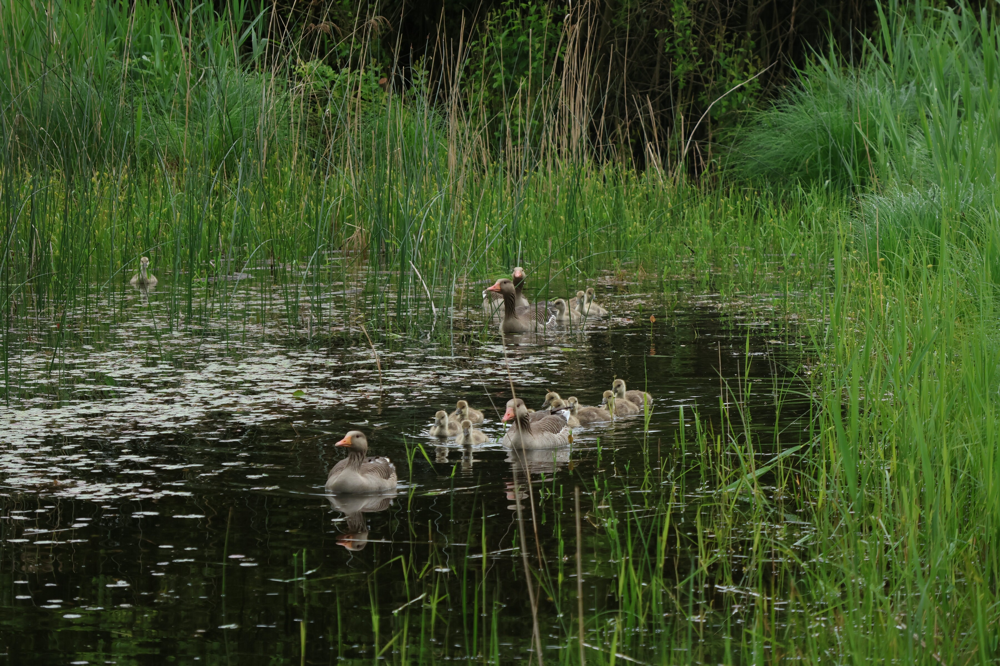
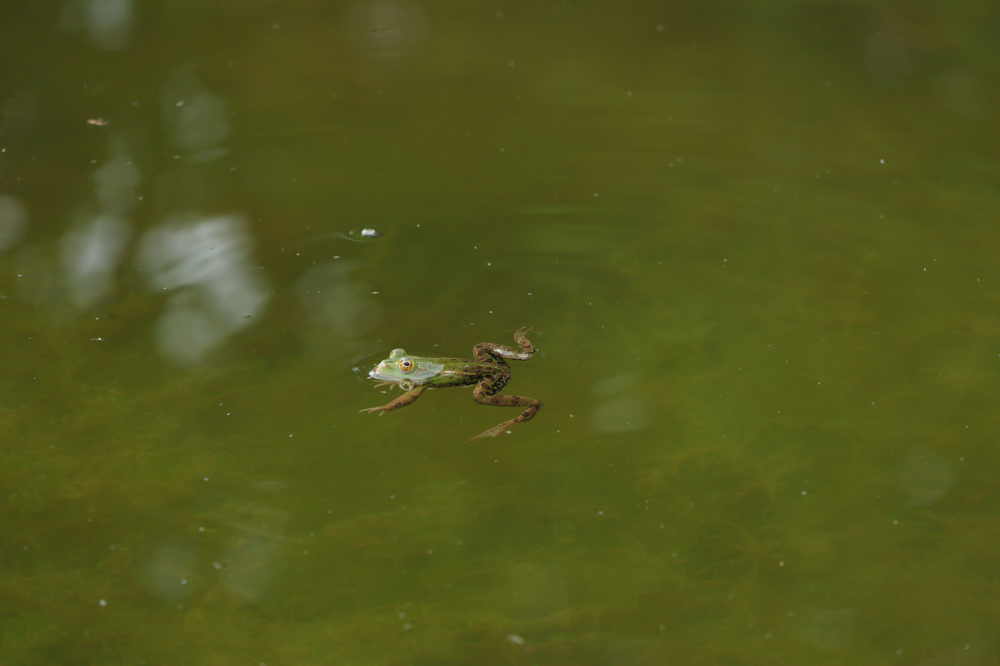

Macro shots from a pond near Uznach: flies, a dragonfly, a dying wasp, and a goose family that wouldn't sit still.

### Macro

::: {layout-ncol=3}

{group="uznach" fig-alt="A long-legged fly resting on a green leaf, wings spread"}

{group="uznach" fig-alt="A fly resting on a cluster of small white wayfaring-tree flowers"}

{group="uznach" fig-alt="A fly feeding among clusters of white blossom"}

{group="uznach" fig-alt="A slender, long-legged insect perched among small white wildflowers"}

{group="uznach" fig-alt="Close-up of a yellow iris flower with dew drops on its petals"}

{group="uznach" fig-alt="An insect entangled in a fine thread of spider silk, wings spread, suspended in mid-air"}

:::

### Pond Wildlife

::: {layout-ncol=3}

{group="uznach" fig-alt="A family of geese with several fluffy goslings standing in grass"}

{group="uznach" fig-alt="A goose family swimming together among reeds in a pond"}

{group="uznach" fig-alt="A green frog floating at the water's surface"}

:::
