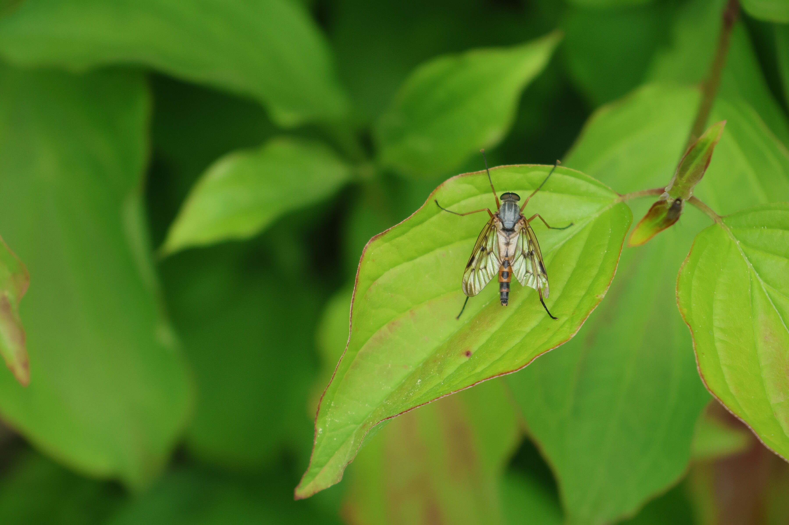
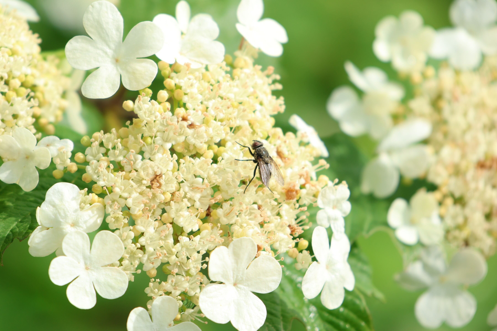
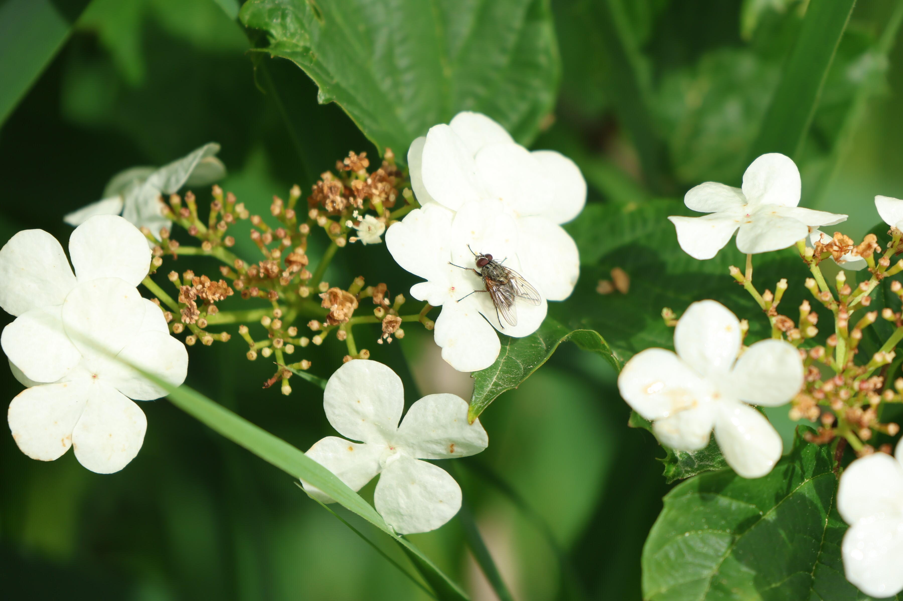
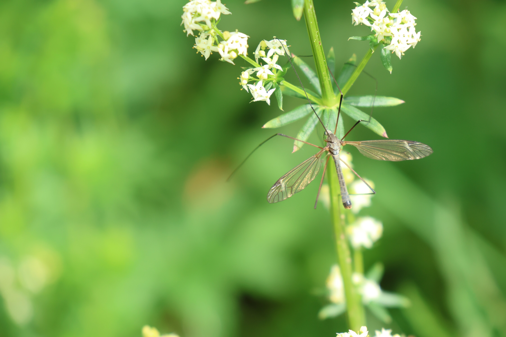
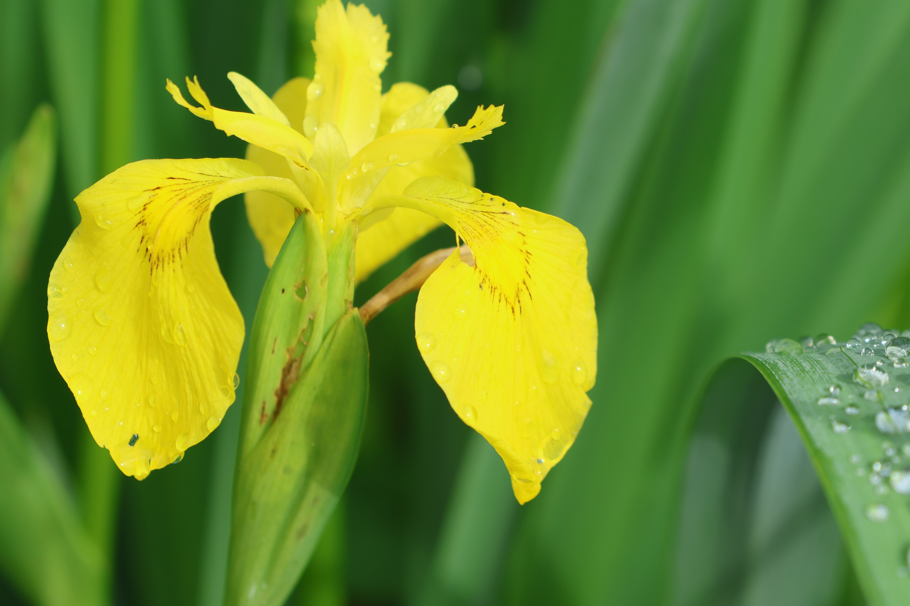
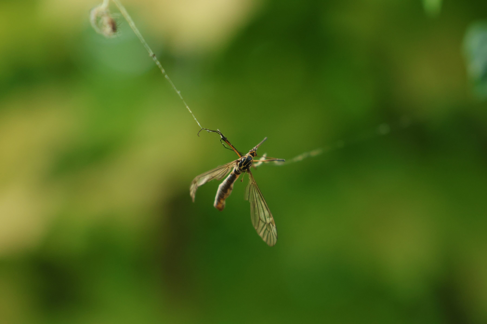
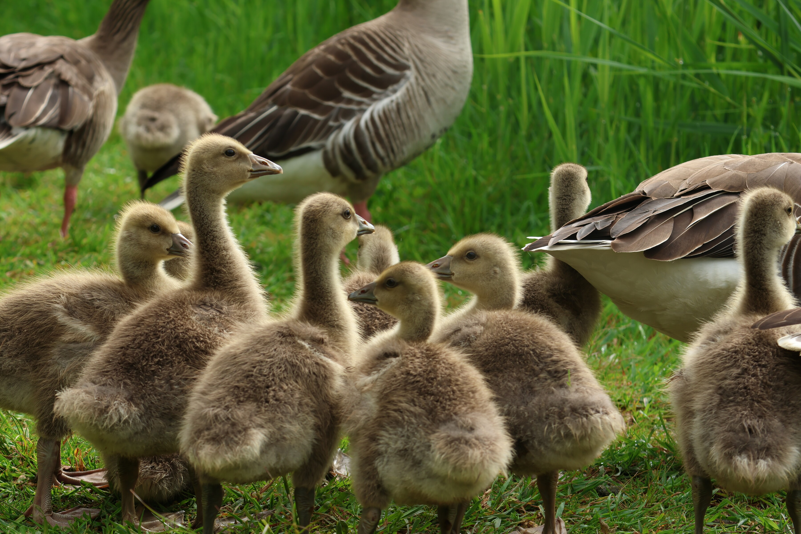
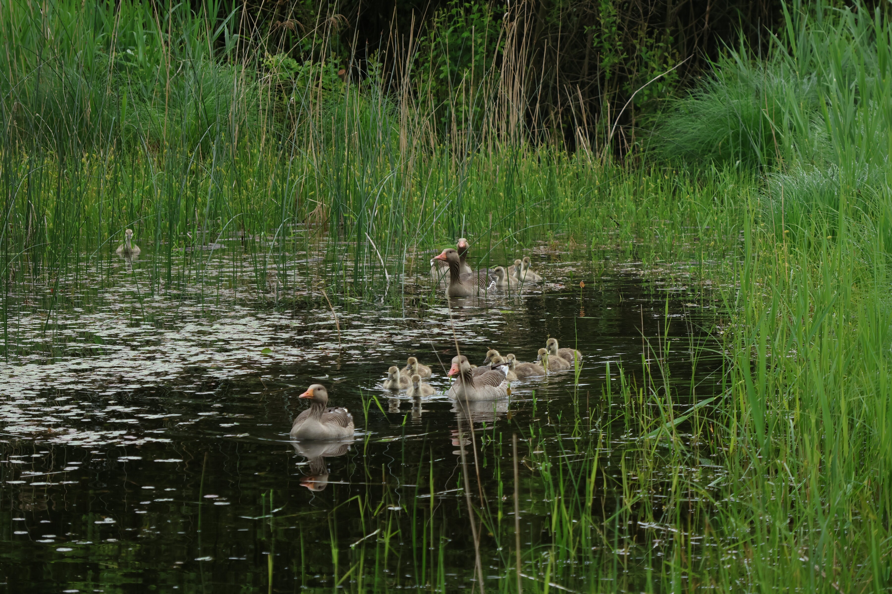
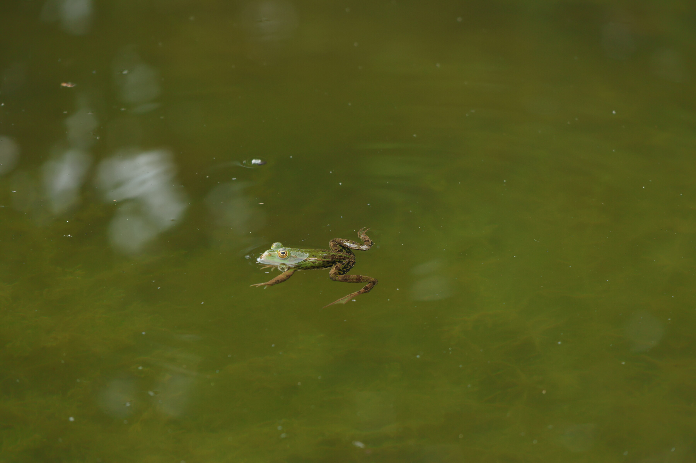

```{=html}
<div style="max-width:900px;margin:0 auto 1.5rem;">
  <p style="font-size:1.1rem;line-height:1.6;color:color-mix(in srgb,var(--bs-body-color) 72%,transparent);">
  Macro shots from a pond near Uznach: flies, a dragonfly, a dying wasp, and a goose family
  that wouldn't sit still.</p>
</div>

<h2 class="jhs-album-section-title">Macro</h2>
<div class="jhs-album-grid">
  <div class="tile"></div>
  <div class="tile"></div>
  <div class="tile"></div>
  <div class="tile"></div>
  <div class="tile"></div>
  <div class="tile"></div>
</div>

<h2 class="jhs-album-section-title">Pond wildlife</h2>
<div class="jhs-album-grid">
  <div class="tile"></div>
  <div class="tile"></div>
  <div class="tile"></div>
</div>
```
