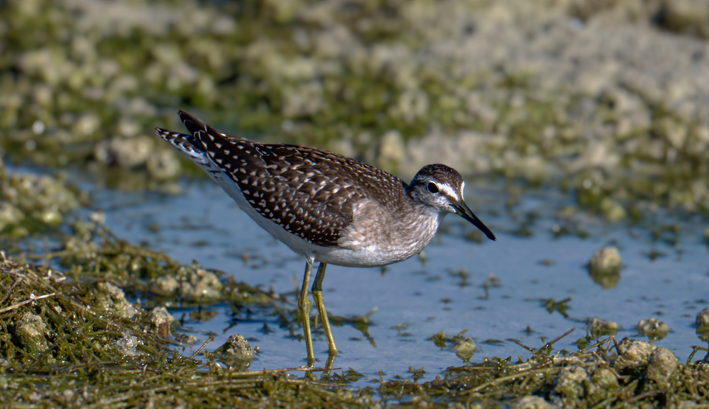
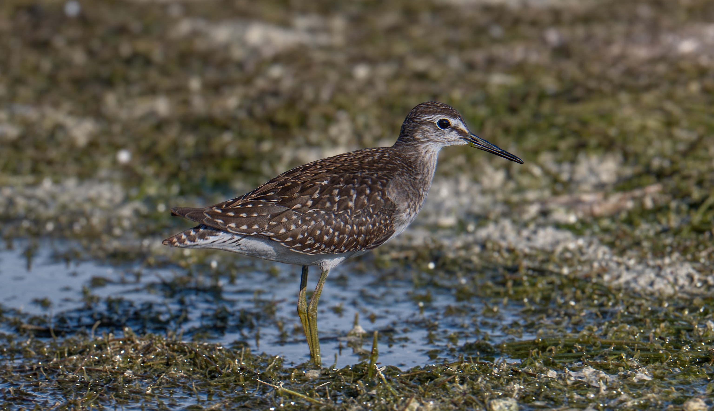
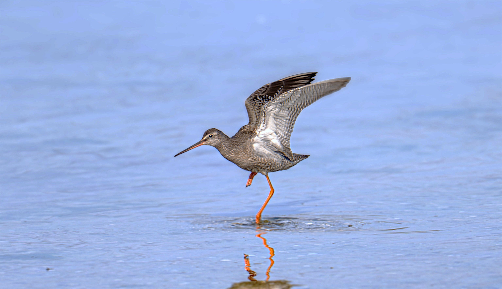
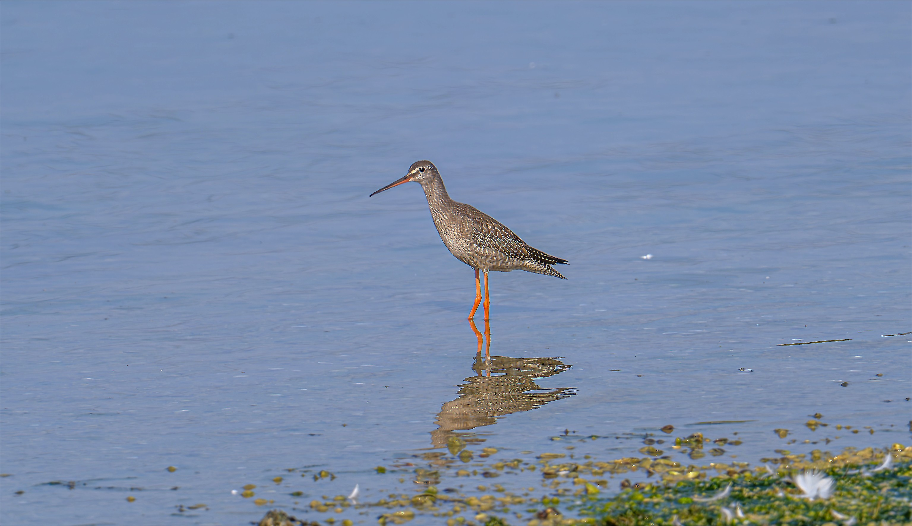
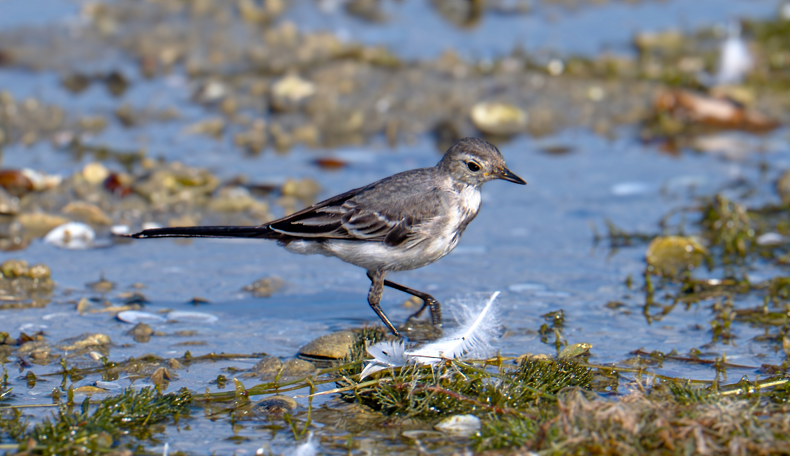
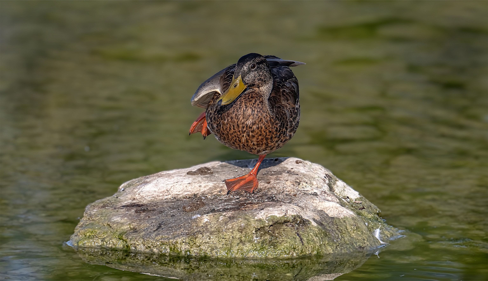
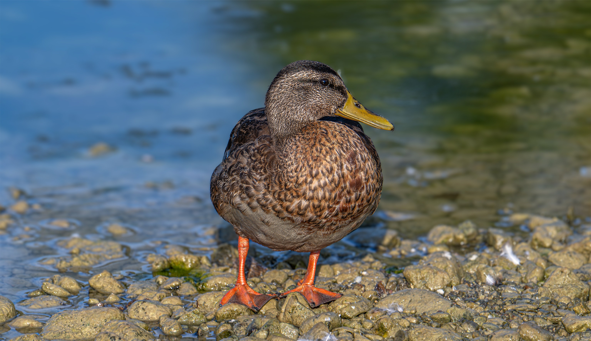
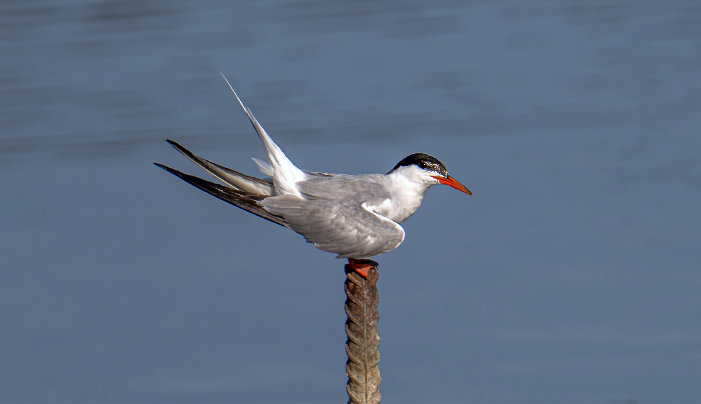
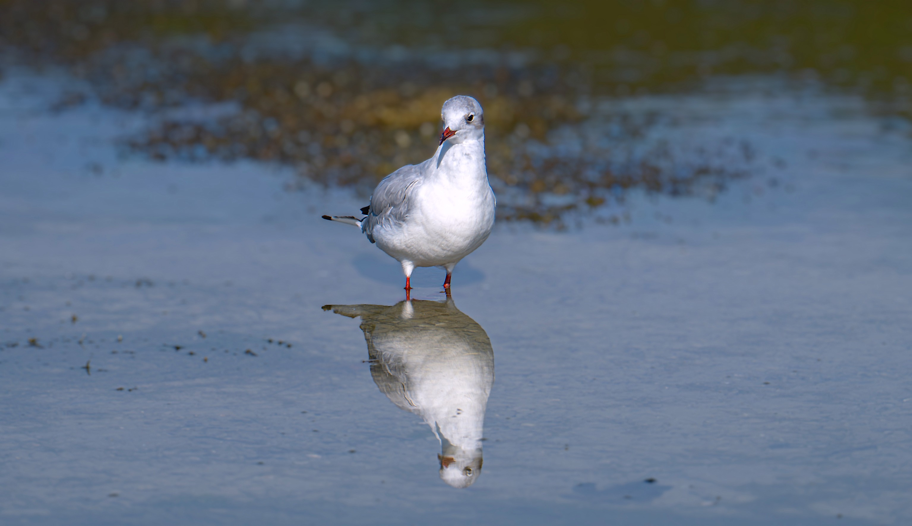
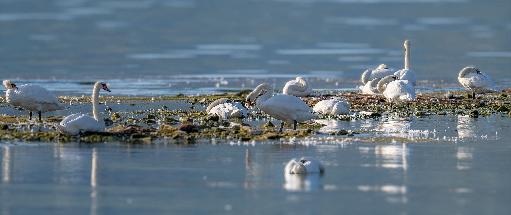

```{=html}
<div class="jhs-album-intro">
  <p class="jhs-page-intro">
  Low water at the Holzsteg in Rapperswil — the wooden footbridge across the upper end of
  Lake Zürich — turned the shallows into a rest stop for migrating waders, with the local
  wagtails, gulls, ducks, and swans keeping them company.</p>
</div>

<h2 class="jhs-album-section-title">Waders on migration</h2>
<div class="jhs-album-grid">
  <div class="tile"></div>
  <div class="tile"></div>
  <div class="tile"></div>
  <div class="tile"></div>
</div>

<h2 class="jhs-album-section-title">Along the shore</h2>
<div class="jhs-album-grid">
  <div class="tile"></div>
  <div class="tile"></div>
  <div class="tile"></div>
</div>

<h2 class="jhs-album-section-title">On the lake</h2>
<div class="jhs-album-grid">
  <div class="tile"></div>
  <div class="tile"></div>
  <div class="tile"></div>
</div>
```
