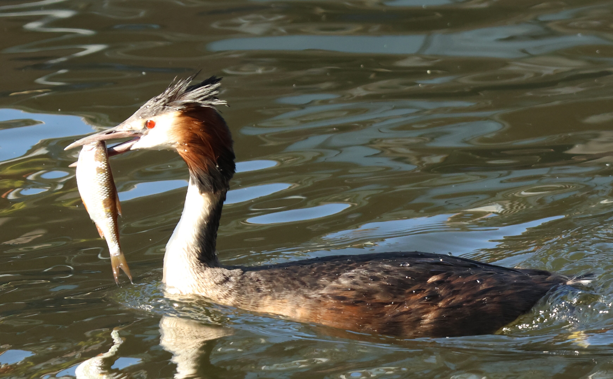
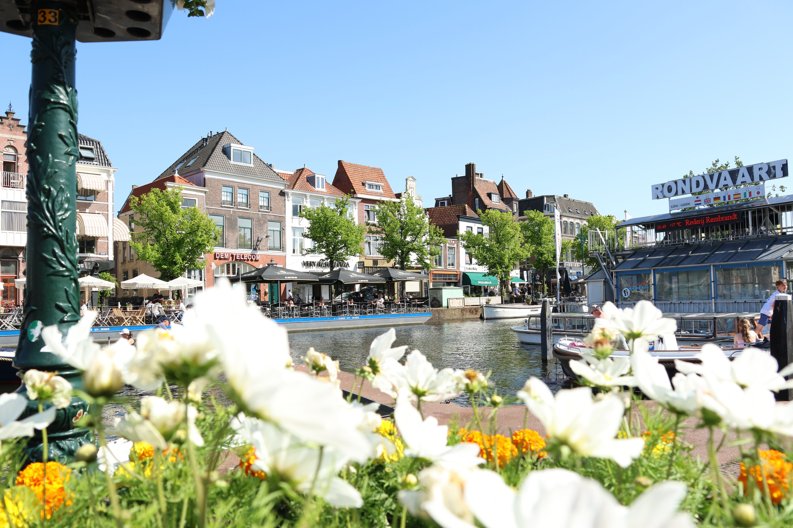
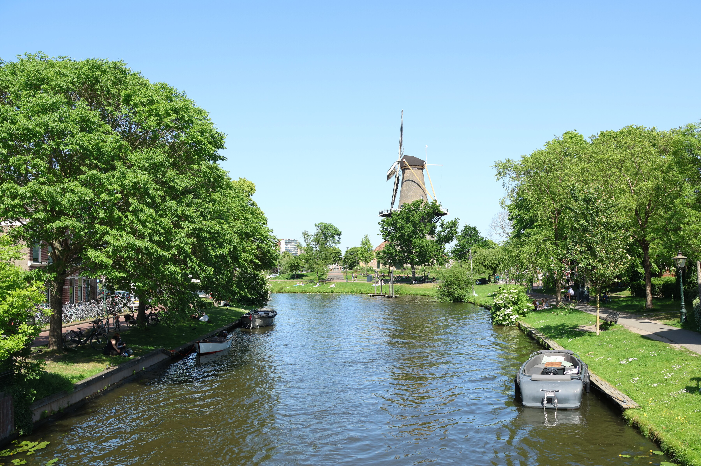
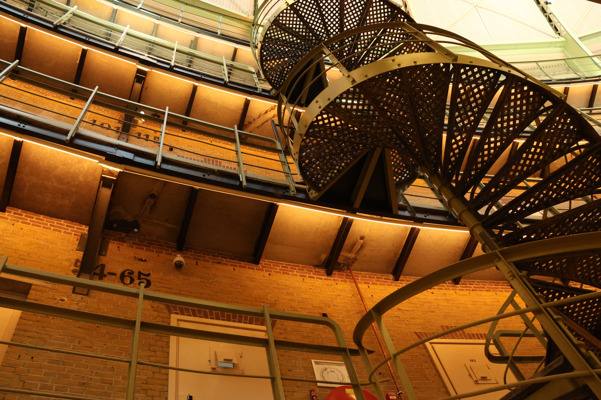
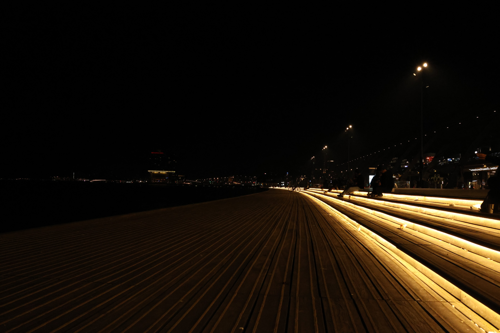
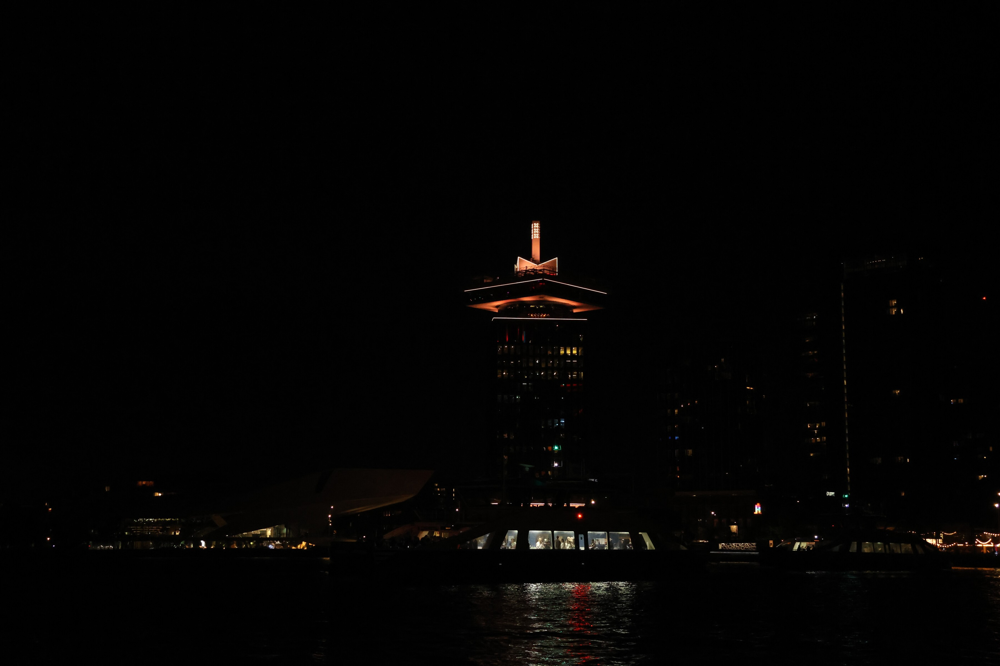
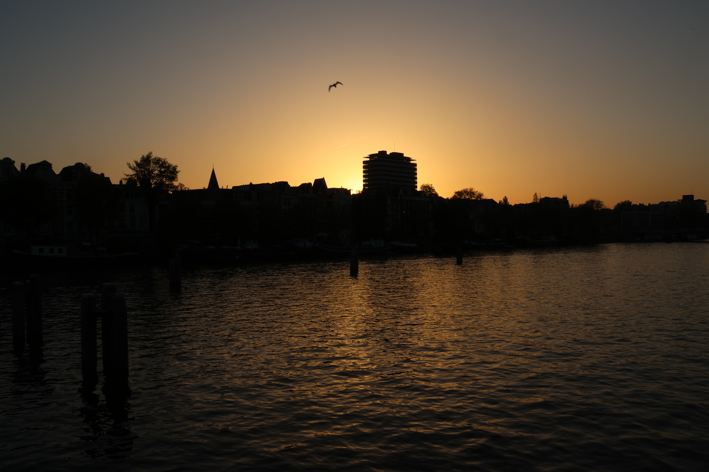
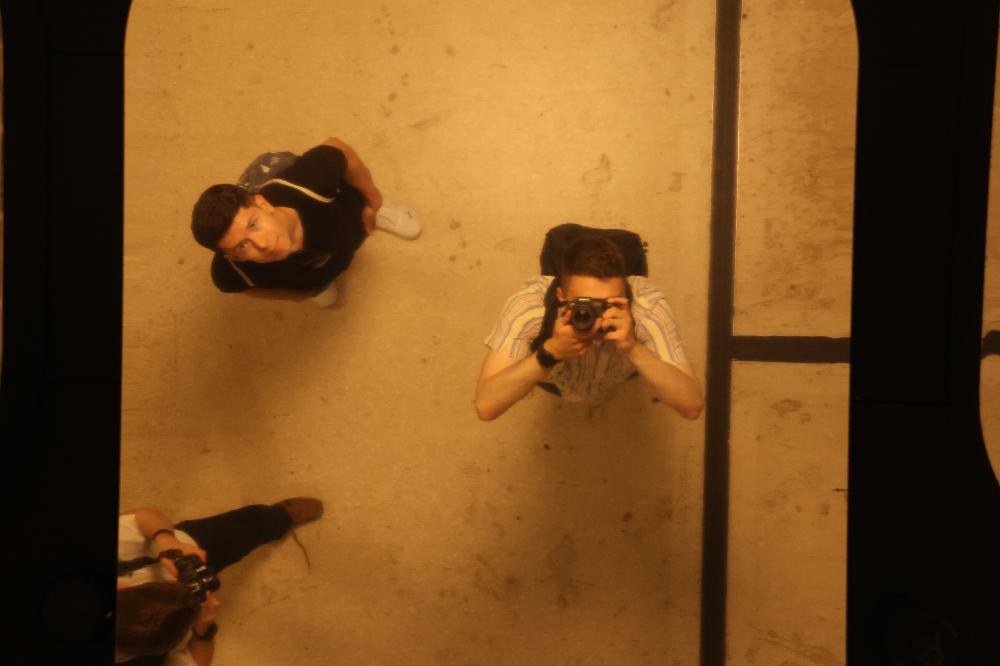

A day wandering the canals and a converted prison turned university, then back out along the IJ after dark.

### By Day

::: {layout-ncol=3}

{group="amsterdam" fig-alt="A great crested grebe swimming with a fish in its beak"}

{group="amsterdam" fig-alt="White and orange flowers in the foreground with an Amsterdam canal and houses behind"}

{group="amsterdam" fig-alt="A traditional Dutch windmill at the end of a tree-lined canal"}

{group="amsterdam" fig-alt="A banner reading 'This Prison Has the Best Escape Plan: A Degree' outside SRH Haarlem University of Applied Sciences"}

{group="amsterdam" fig-alt="A spiral staircase inside a converted prison building, now part of a university"}

:::

### By Night

::: {layout-ncol=2}

{group="amsterdam" fig-alt="Glowing steps along a waterfront promenade at night"}

{group="amsterdam" fig-alt="The illuminated crown of the A'DAM Tower against a dark night sky, reflected in the water"}

{group="amsterdam" fig-alt="Silhouetted skyline glowing under an orange dusk sky with a bird flying overhead"}

{group="amsterdam" fig-alt="A group selfie taken from above with several people looking up at the camera at night"}

:::
