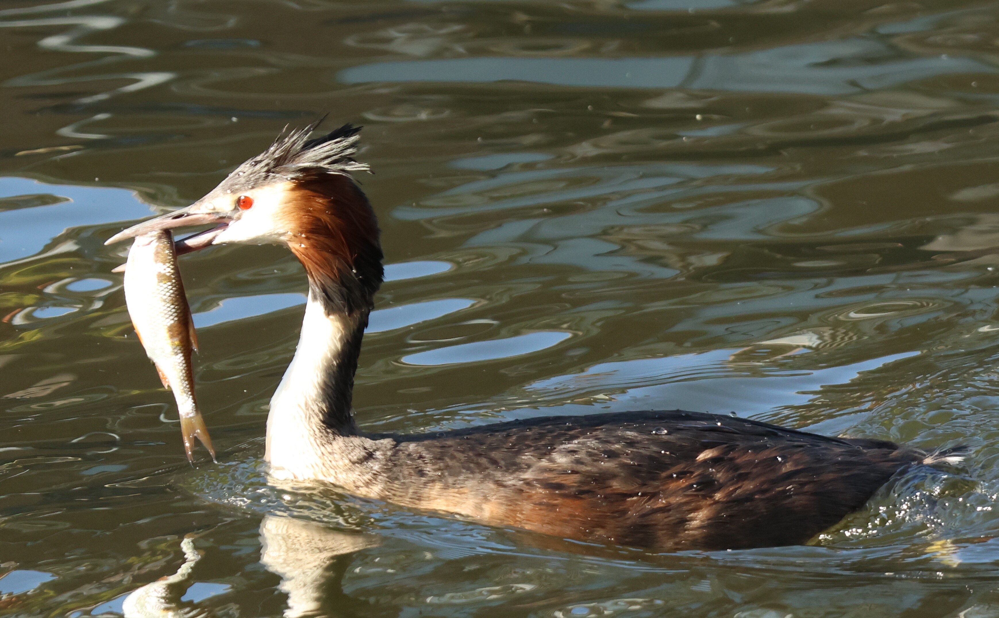
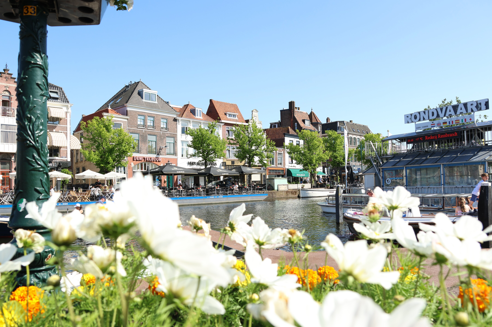
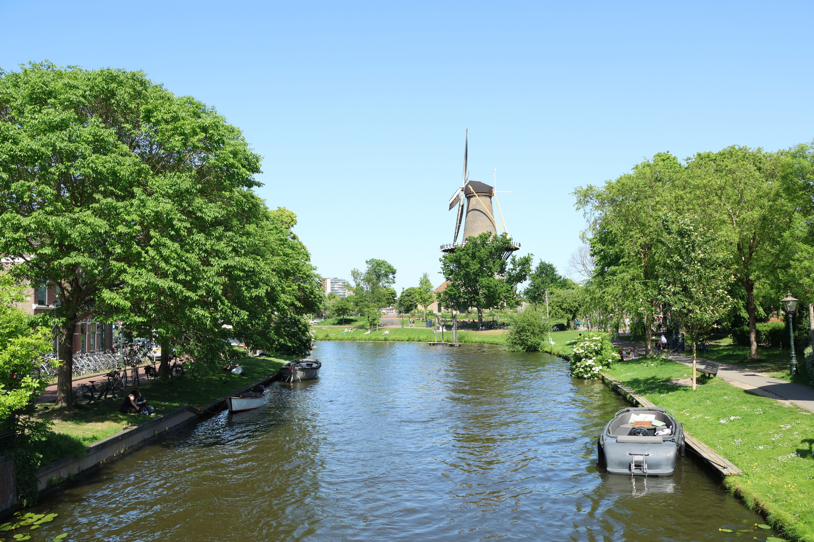
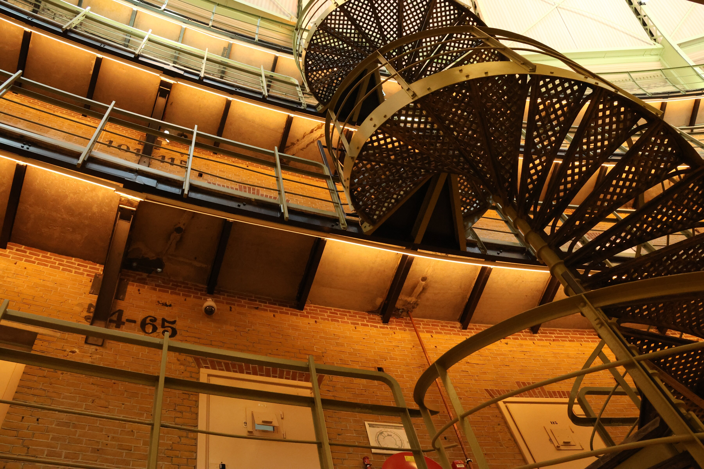
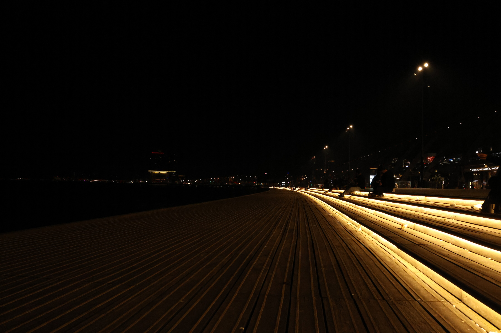
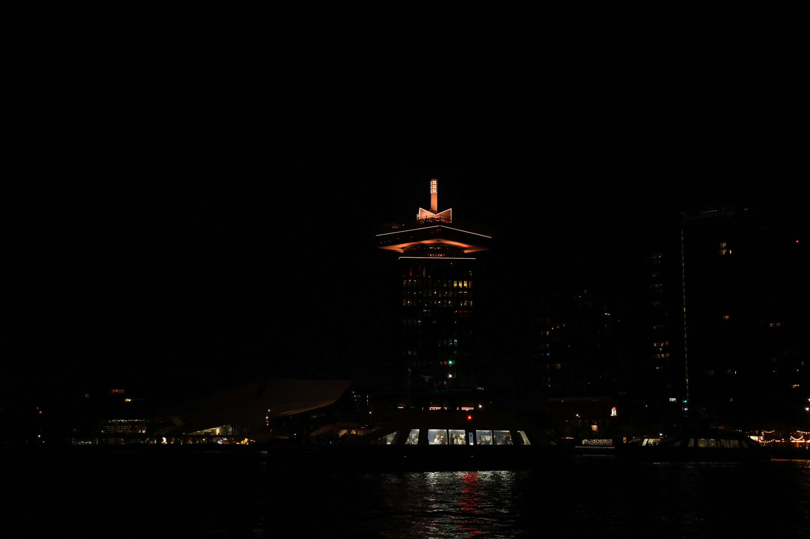
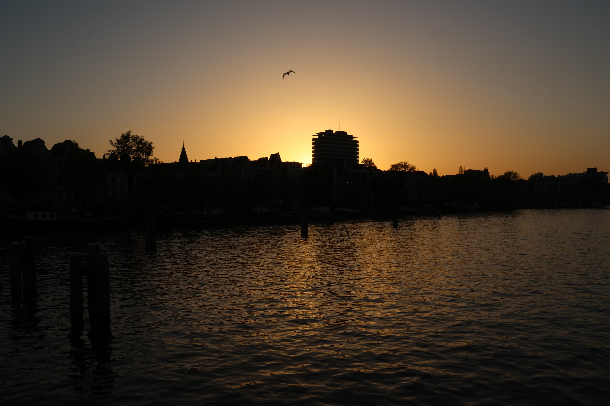
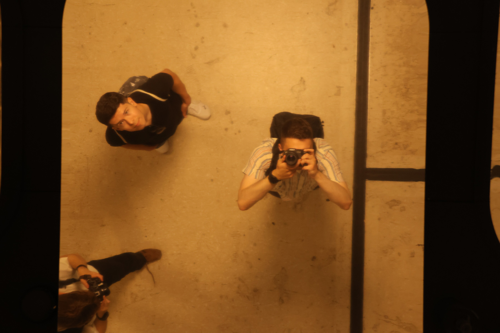

```{=html}
<div class="jhs-album-intro">
  <p class="jhs-page-intro">
  A few days around Amsterdam, Haarlem, Zandvoort, and Utrecht.</p>
</div>

<h2 class="jhs-album-section-title">By day</h2>
<div class="jhs-album-grid">
  <div class="tile"></div>
  <div class="tile"></div>
  <div class="tile"></div>
  <div class="tile"></div>
  <div class="tile"></div>
</div>

<h2 class="jhs-album-section-title">By night</h2>
<div class="jhs-album-grid">
  <div class="tile"></div>
  <div class="tile"></div>
  <div class="tile"></div>
  <div class="tile"></div>
</div>
```
