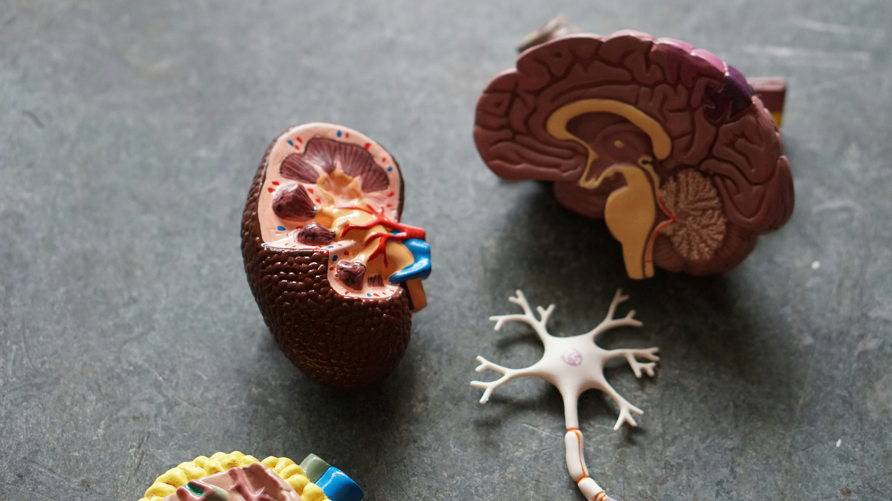

## Introduction

Neural networks have a frustrating habit: when you train them on a new task, they tend to forget what they learned before. This phenomenon, known as *catastrophic forgetting*, was first documented by @cf-first-paper and remains one of the central challenges in continual learning — the problem of training a single model on a sequence of tasks without losing previously acquired knowledge.

At the same time, a separate line of work in optimization theory has produced a striking empirical finding. @gurari2018gradientdescenthappenstiny showed that gradient descent in neural networks effectively happens in a *tiny subspace* of the full parameter space — specifically, the eigenspace corresponding to the small (bulk) eigenvalues of the loss Hessian, rather than the sharper, high-curvature dominant directions. This is perhaps counterintuitive: one might expect learning to be driven by the directions of highest curvature.

The full code for this project is available on [<i class="bi bi-github"></i> GitHub](https://github.com/JHSchlegel/cf-tiny-subspaces).

In a course project for ETH's *Deep Learning* class, my co-authors Rufat Asadli, Armin Begic, and Philemon Thalmann and I asked: **does catastrophic forgetting also happen in tiny subspaces?** If the same geometric structure governs both learning and forgetting, that has real implications for how we might design continual learning algorithms that preserve old knowledge while acquiring new.

## Background

### Continual Learning and Catastrophic Forgetting

In continual learning, a model is trained on a sequence of tasks $\tau_1, \tau_2, \ldots, \tau_T$ — each potentially drawn from a different data distribution — without access to past data when training on later tasks. The challenge is that gradient updates on task $\tau_t$ tend to overwrite weights that were carefully tuned for earlier tasks, causing the model's performance on $\tau_1, \ldots, \tau_{t-1}$ to degrade. This is catastrophic forgetting [@cf-first-paper; @goodfellow2013empirical].

Following @van2022three, continual learning scenarios can be broadly classified into three settings. We focus on two:

- **Domain-IL**: The task identity is not provided at test time; all tasks share the same output space but differ in their input distribution. Think of it as the same network solving variations of the same problem without being told which variation it is currently facing.
- **Task-IL**: The task identity is available at test time, and each task has its own dedicated classification head. This is an easier setting since the network only needs to choose among the classes of the currently active task.

Catastrophic forgetting is most severe in Domain-IL, where the network must solve all tasks from the same shared output layer.

### Gradient Descent in Tiny Subspaces

To understand our setup, consider the **loss Hessian** $\nabla^2 \mathcal{L}(\theta)$ — the matrix of all second-order derivatives of the training loss with respect to the model parameters $\theta$. The Hessian captures the local curvature of the loss landscape. Its eigendecomposition gives eigenvalues $\lambda_1 \geq \lambda_2 \geq \ldots \geq \lambda_p$ and corresponding eigenvectors $u_1, u_2, \ldots, u_p$.

The eigenvectors with *large* eigenvalues point in the directions of highest curvature — these are the **dominant** directions. The eigenvectors with *small* eigenvalues point in much flatter directions — these form the **bulk**.

@gurari2018gradientdescenthappenstiny found that the gradient at any training step is almost entirely contained within the bulk subspace. In other words, gradient descent steps barely project onto the dominant directions, even though those directions are the "sharpest" in the landscape. @song2024doessgdreallyhappen later refined this finding, but the qualitative picture — learning lives in low-curvature territory — has proven robust.

Our central question: **does this geometry also govern catastrophic forgetting in continual learning?**

## Setup

### Dominant and Bulk Subspaces

Formally, for a given task $\tau$ and model parameters $\theta_\tau$, the **dominant subspace** of size $k$ is:

$$
\mathcal{S}_k = \text{span}\{u_i : i \in [k]\}
$$

with corresponding projection matrix $P_k = \sum_{i=1}^{k} u_i u_i^\top$.

The **bulk subspace** is its orthogonal complement, with projection $P_k^\perp = I - P_k$. In plain terms: project a gradient onto $P_k$ to keep only the high-curvature components; project onto $P_k^\perp$ to keep only the flat, bulk components.

To measure how much the dominant subspace shifts across training, we define the **top-$k$ subspace overlap** between parameter configurations at steps $t$ and $t'$:

$$
O\!\left(\mathcal{S}_k^{(t)},\, \mathcal{S}_k^{(t')}\right) = \frac{1}{k} \sum_{j=1}^{k} \left\| P_k^{(t)}\, u_j^{(t')} \right\|_2^2
$$

An overlap of 1.0 means the two dominant subspaces are identical; an overlap of 0 means they are completely orthogonal. We approximate the Hessian eigenvectors using the Lanczos algorithm via the `pytorch-hessian-eigenthings` library [@hessian-eigenthings].

### Two Constrained Optimizers

To test whether learning and forgetting are geometrically localised, we introduce two variants of SGD that constrain gradient updates to a specific subspace.

**CL-Bulk-SGD** projects each gradient update onto the bulk subspace before applying it:

$$
\theta \leftarrow \theta - \eta\, P_k^\perp(\theta)\, \nabla \mathcal{L}(\theta)
$$

The dominant directions are blocked entirely — the model can only learn in the flat, bulk directions. If learning naturally happens in the bulk, this constraint should cost almost nothing.

**CL-Dom-SGD** does the opposite and restricts updates to the dominant subspace:

$$
\theta \leftarrow \theta - \eta\, P_k(\theta)\, \nabla \mathcal{L}(\theta)
$$

If learning requires the bulk, this constraint should substantially hurt performance. Conversely, since CL-Dom-SGD never touches the bulk, it should also preserve any knowledge stored there — so if forgetting happens in the bulk, this method should reduce it (possibly at the cost of learning less).

For the first task, both methods fall back to standard SGD. From task 2 onwards, the projection is applied at every gradient step.

### Datasets and Architecture

We experiment on three standard continual learning benchmarks:

- **Permuted MNIST** (Domain-IL): 10 tasks, each applying a unique fixed random pixel permutation to MNIST digits. The same 10 output classes are used throughout; only the input statistics differ.
- **Split-CIFAR10** (Task-IL): CIFAR-10 split into 5 tasks of 2 classes each, with a separate classification head per task.
- **Split-CIFAR100** (Task-IL): CIFAR-100 split into 10 tasks of 10 classes each, again with per-task heads.

For Permuted MNIST we use an MLP with two hidden layers of 100 ReLU units. For the CIFAR benchmarks we use a two-layer CNN with 32 output channels. All models are trained with SGD for 5 epochs per task, batch size 128. We subsample 2,000 data points per Hessian approximation, and in the Task-IL setting we only project the convolutional layers (the task-specific heads remain unconstrained).

The value of $k$ — the number of dominant directions to block or preserve — is set to 10 for Permuted MNIST (matching the 10 task permutations), 2 for Split-CIFAR10 (matching the 2 classes per task), and 9 for Split-CIFAR100.

## Results

### Is There a Clear Dominant Subspace?

Before asking whether forgetting is localised in a particular subspace, we first confirm that the loss Hessian actually has a well-separated spectral structure. The figure below plots the top-$k$ eigenvalues against the next-$k$ eigenvalues across training, with red dashed lines marking task boundaries.

<table>
<tr>
<td style="width:33%; padding:4px;">

<em>Permuted MNIST</em>
</td>
<td style="width:33%; padding:4px;">

<em>Split-CIFAR10</em>
</td>
<td style="width:33%; padding:4px;">

<em>Split-CIFAR100</em>
</td>
</tr>
</table>

Across all three benchmarks, a clear **spectral gap** emerges: the top-$k$ eigenvalues (colored, one line per task) are substantially larger than the next-$k$ eigenvalues (gray/teal), and this gap widens over the course of training. This confirms that the dominant subspace is geometrically meaningful — it captures the genuinely sharp directions of the loss landscape, while the bulk represents a large region of much flatter directions.

### How Task-Specific is the Dominant Subspace?

If forgetting is driven by changes in the dominant subspace, we would expect abrupt shifts in that subspace at task boundaries — old tasks' sharp directions being replaced by new ones. The overlap metric quantifies this: a value close to 1 means the dominant subspace is essentially unchanged; a value close to 0 means it has rotated entirely.

<table>
<tr>
<td style="width:33%; padding:4px;">

<em>Permuted MNIST</em>
</td>
<td style="width:33%; padding:4px;">

<em>Split-CIFAR10</em>
</td>
<td style="width:33%; padding:4px;">

<em>Split-CIFAR100</em>
</td>
</tr>
</table>

The pattern is notably different between Domain-IL and Task-IL. For **Permuted MNIST**, the overlap drops sharply at each task boundary — every new permutation requires a largely orthogonal dominant subspace, a strong signal that those directions are highly task-specific. For the **CIFAR benchmarks**, transitions are softer: some overlap persists across tasks, particularly between earlier tasks (the cyan line stays elevated relative to later-introduced tasks). This likely reflects that the underlying visual structure is shared across CIFAR splits even when the class labels differ.

### Training Dynamics Under Gradient Constraints

Does forcing the optimizer to work exclusively in the bulk or dominant subspace impair training? The figure below compares training cross-entropy loss across the three methods throughout the full sequential training run.

<table>
<tr>
<td style="width:33%; padding:4px;">

<em>Permuted MNIST</em>
</td>
<td style="width:33%; padding:4px;">

<em>Split-CIFAR10</em>
</td>
<td style="width:33%; padding:4px;">

<em>Split-CIFAR100</em>
</td>
</tr>
</table>

CL-Bulk-SGD and standard SGD are nearly indistinguishable across all tasks and benchmarks — their training loss curves follow almost the same trajectory throughout. **Restricting gradient updates to the bulk subspace has essentially no cost in terms of training dynamics.** The model learns just as well when the high-curvature dominant directions are blocked.

CL-Dom-SGD is noticeably slower to converge, particularly on CIFAR. When only the sharp dominant directions are available for updates, learning is clearly impaired.

### The Main Question: Accuracy and Forgetting

The figure below shows test accuracy per task, evaluated after each new task is trained. Each colored line tracks one task's accuracy as later tasks are introduced.

<table>
<tr>
<td style="width:33%; padding:4px;">

<em>Permuted MNIST</em>
</td>
<td style="width:33%; padding:4px;">

<em>Split-CIFAR10</em>
</td>
<td style="width:33%; padding:4px;">

<em>Split-CIFAR100</em>
</td>
</tr>
</table>

CL-Bulk-SGD and standard SGD produce near-identical per-task accuracy curves. CL-Dom-SGD achieves visibly lower accuracy, most strikingly on Split-CIFAR10 where one task (green) drops substantially below the other two methods.

The table below summarises these results numerically. *Average Accuracy* is the mean test accuracy across all tasks at the end of training. *Average Maximum Forgetting* is the mean decrease from each task's peak accuracy — a direct measure of how much previously learned knowledge is lost.

 

| Method | pMNIST Acc. | pMNIST Forget | CIFAR-10 Acc. | CIFAR-10 Forget | CIFAR-100 Acc. | CIFAR-100 Forget |
|:---|:---:|:---:|:---:|:---:|:---:|:---:|
| Joint (upper bound) | 96.60% | 0.00% | 79.47% | 0.00% | 46.60% | 0.00% |
| Standard SGD | 64.08% | 31.31% | 76.20% | 0.60% | 23.94% | 1.29% |
| **CL-Bulk-SGD** | **62.09%** | **33.50%** | **76.23%** | **0.48%** | **24.15%** | **1.53%** |
| CL-Dom-SGD | 45.72% | 8.01% | 71.59% | 1.24% | 21.77% | 0.32% |

: Average accuracy and forgetting across methods and benchmarks. Bold rows indicate the best constrained method. {.striped .hover}

 

Three findings stand out:

1. **CL-Bulk-SGD ≈ Standard SGD** across all benchmarks — in both accuracy and forgetting. Constraining the optimizer to the bulk subspace costs essentially nothing. This is the headline result and directly confirms that learning in continual neural networks is concentrated in the bulk.

2. **CL-Dom-SGD reduces forgetting on Permuted MNIST** (8.01% vs 31.31%) but at the cost of much worse accuracy (45.72% vs 64.08%). This is consistent with forgetting being partly driven by bulk updates: once you block the bulk, the model stops overwriting old knowledge — but it also stops learning new tasks effectively.

3. **On Task-IL (CIFAR), the picture is less clean.** CL-Dom-SGD shows slightly *more* forgetting in some cases and consistently lower accuracy. The per-task classification heads likely absorb some of the task-specific information, making the subspace decomposition of the shared convolutional layers harder to interpret.

### Max Eigenvalue Across Optimizers

As an additional sanity check, we compare the largest Hessian eigenvalue across the three methods.

<table>
<tr>
<td style="width:33%; padding:4px;">

<em>Permuted MNIST</em>
</td>
<td style="width:33%; padding:4px;">

<em>Split-CIFAR10</em>
</td>
<td style="width:33%; padding:4px;">

<em>Split-CIFAR100</em>
</td>
</tr>
</table>

CL-Bulk-SGD and standard SGD maintain comparable, steadily increasing dominant eigenvalues throughout training — consistent with the edge-of-stability phenomenon noted in @cohen-CNN. CL-Dom-SGD shows noticeably different and more variable eigenvalue dynamics. Updating only in the dominant directions perturbs the curvature structure at every step, resulting in less stable Hessian behaviour. This is further evidence that the dominant subspace is not where effective learning naturally lives.

## Ablations

To check robustness, we vary key hyperparameters for CL-Bulk-SGD: network width (hidden units / output channels), batch size, and learning rate. The figures below show the top-$k$ overlap trajectories and largest eigenvalue dynamics across these hyperparameter grids.

<table>
<tr>
<td style="width:33%; padding:4px;">

<em>Permuted MNIST</em>
</td>
<td style="width:33%; padding:4px;">

<em>Split-CIFAR10</em>
</td>
<td style="width:33%; padding:4px;">

<em>Split-CIFAR100</em>
</td>
</tr>
</table>

<table>
<tr>
<td style="width:33%; padding:4px;">

<em>Permuted MNIST</em>
</td>
<td style="width:33%; padding:4px;">

<em>Split-CIFAR10</em>
</td>
<td style="width:33%; padding:4px;">

<em>Split-CIFAR100</em>
</td>
</tr>
</table>

Network width and batch size have at most a mild effect on the qualitative patterns — the dominant subspace still shifts at task transitions, and the spectral gap persists across architectures. **Learning rate is the most influential hyperparameter**: very small rates produce noisy, hard-to-interpret overlap trajectories (likely because the model does not fully converge within the 5-epoch budget), while moderate rates yield the cleaner dynamics we observe in the main experiments.

## Reflections

The central finding is clear: **learning in continual neural networks happens in the bulk subspace**, exactly as it does in standard single-task training. Projecting away the dominant directions (CL-Bulk-SGD) leaves both training loss and test accuracy essentially unchanged relative to standard SGD — and this holds across three benchmarks, two continual learning paradigms, and a range of hyperparameter choices.

The forgetting story is more nuanced. On Permuted MNIST (Domain-IL), the dominant subspace rotates significantly at each task boundary, and CL-Dom-SGD succeeds in reducing measured forgetting — albeit at the cost of worse accuracy. This is consistent with the hypothesis that forgetting, too, is driven by bulk updates: once you block the bulk, the model can no longer effectively overwrite old task knowledge. On Split-CIFAR (Task-IL), the picture is murkier. The per-task classification heads absorb part of the task-specific signal, leaving the shared convolutional backbone less clearly partitioned between tasks.

There are real limitations to this study worth acknowledging. The architectures are deliberately small — an MLP with 100 hidden units and a two-layer CNN — and trained with vanilla SGD for just 5 epochs per task. Scaling to larger models (e.g., ResNet-18), adaptive optimizers (e.g., Adam [@kingma2014adam]), and longer training horizons may change the qualitative picture. Computing Hessian eigenvectors via the Lanczos algorithm at every training step also has a non-trivial computational cost, which limits scalability to larger networks.

That said, the framework offers a principled, geometry-first lens for reasoning about *where* in parameter space learning and forgetting are concentrated — and the evidence points consistently to the low-curvature bulk. Whether that structure can be exploited to design better continual learning algorithms remains, we think, a genuinely open and interesting question.
